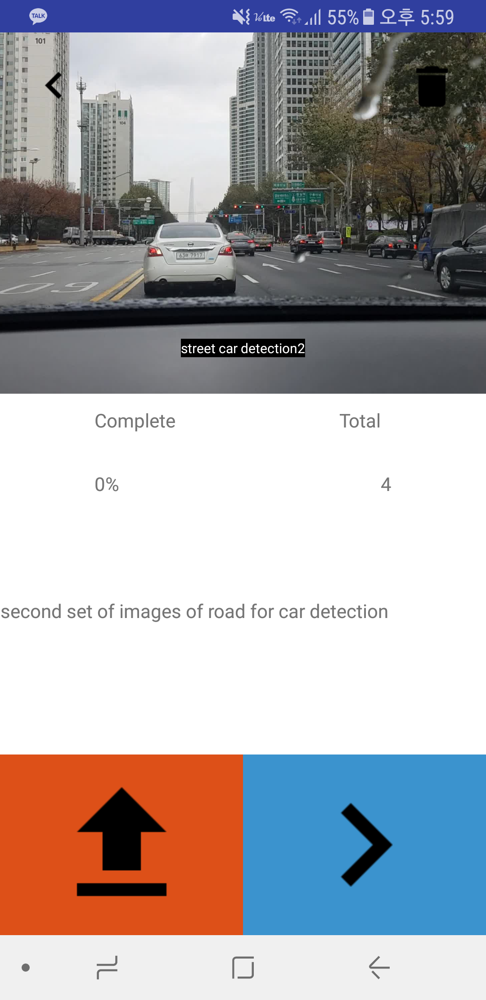
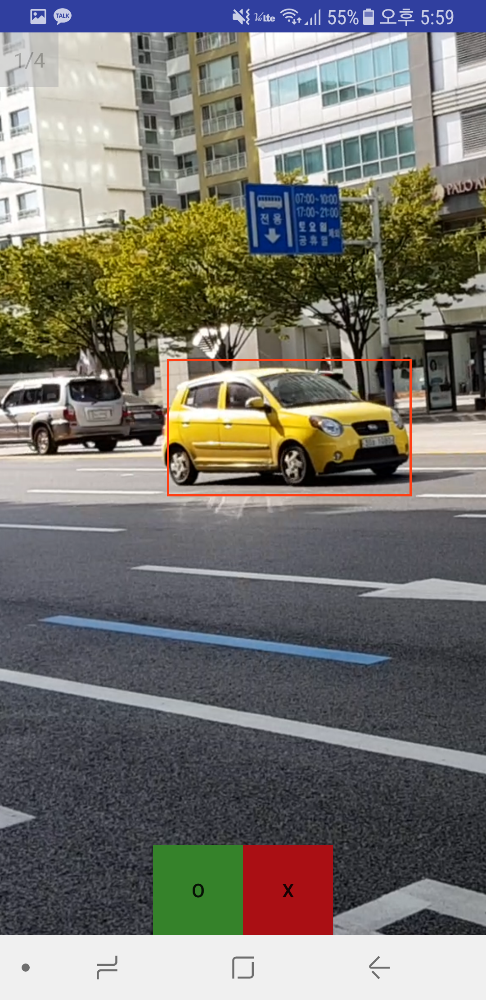
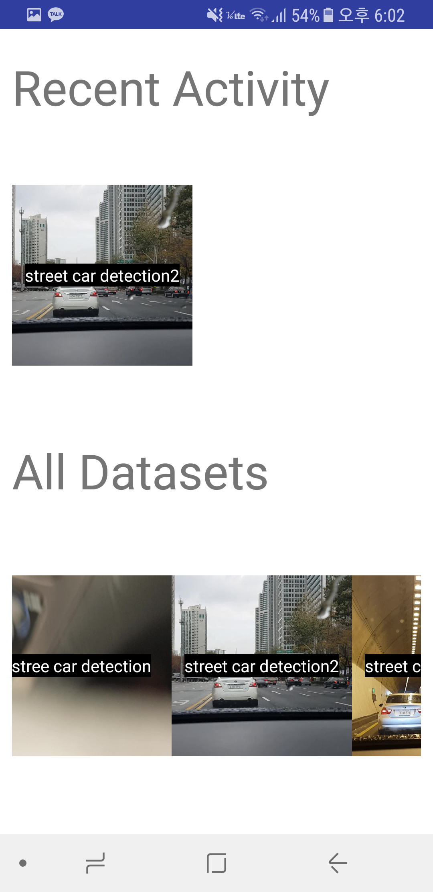

# Datalabeling App
## About
Datalabeling App is an open source, image bounding box labeling app for Android.

Backend for this application is not included in this project.

## Features
- image zoom in/out
- bounding box select/delete
- dataset download
- user authentication through google account

## How it looks like

## Setup
- please create `serverinfo.txt` in `/assets` directory which contains a single line of ip address towards the back-end.

## License
This project is under MIT License.
